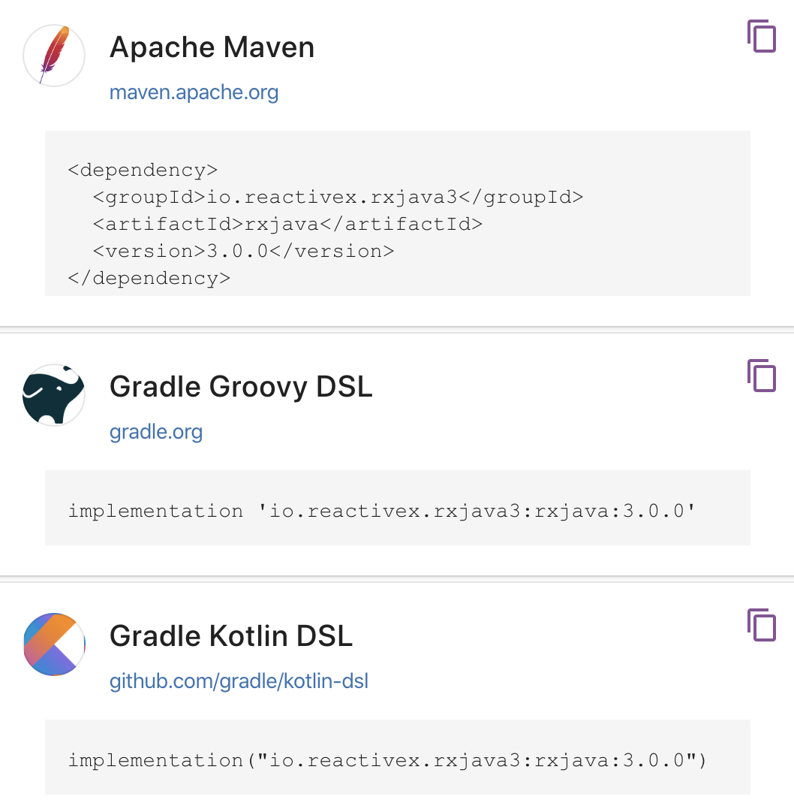

# Programacion Reactiva <hr>
Programacion Reactiva
https://github.com/PacktPublishing/Learning-RxJava-Second-Edition
<hr>

## Tabla de contenido

- [Capitulo 1](#capitulo-1)
- [Capitulo 2](#capitulo-2)

<hr> 

# **_Capitulo 1_**

### Pensando de manera Reactiva

Asumimos que estás bastante cómodo con Java y sabes cómo usar **clases**, **interfaces**, **métodos**,
**propiedades**, **variables**, **alcances estáticos/no estáticos** y **colecciones**. Si no estás familiarizado con
la concurrencia o la multitarea, no te preocupes. RxJava hace que estos temas avanzados sean mucho
más accesibles.

Ten listo tu entorno de desarrollo Java favorito, ya sea IntelliJ IDEA, Eclipse, NetBeans u otro
entorno de tu elección. Nosotros utilizaremos IntelliJ IDEA, aunque no debería importar ni tener un
impacto en los ejemplos de este libro. Recomendamos que tengas un marco de construcción de proyectos
como Gradle o Maven, los cuales explicaremos cómo usar en breve.

En este capítulo, antes de profundizar en RxJava, cubriremos algunos temas fundamentales:

- Una breve historia de Reactive Extensions y RxJava
- Pensando de manera reactiva
- Aprovechando RxJava
- Configurando tu primer proyecto RxJava
- Construyendo tus primeras aplicaciones reactivas
- Las diferencias entre RxJava 1.x, 2.x y 3.0

### Historia

La programación reactiva, que _**complementa la programación orientada a objetos y
funcional**_, ha ganado importancia debido a la creciente complejidad de las
demandas comerciales y de los usuarios. Reactive Extensions (ReactiveX),
creada por Erik Meijer para .NET, se convirtió en un estándar de programación
reactiva en múltiples lenguajes, incluido Java con RxJava. RxJava,
desarrollado por Ben Christensen y David Karnok, es crucial para el
desarrollo de Android y backend en Java, y es compatible con varias
bibliotecas y marcos que se han adaptado para trabajar de forma reactiva.
La filosofía de ReactiveX considera que **los eventos son datos y viceversa**,
lo que representa un enfoque integral para la programación moderna.

### Pensando de manera reactiva

<p>
La programación reactiva propone que todo en el mundo está en movimiento y 
que los eventos ocurren de manera concurrente. A menudo, los desarrolladores 
gestionan el estado de los objetos de manera secuencial, pero RxJava facilita 
la ejecución simultánea de procesos y la gestión de flujos de eventos. 
Los elementos estáticos, como libros y CDs, también pueden ser 
considerados como flujos de datos en movimiento. La programación reactiva 
trata los eventos como datos y los datos como eventos, permitiendo un 
enfoque más natural y funcional en el desarrollo de software.
</p>

### ¿Por qué debería aprender RxJava?

<p>
RxJava y ReactiveX abordan problemas comunes de programación, 
como la concurrencia y la recuperación de excepciones, 
mejorando la mantenibilidad y evolución del código. 
La demanda de aplicaciones responsivas en tiempo real hace que la 
programación reactiva sea valiosa para trabajar con datos en vivo y 
escalar con concurrencia. La programación reactiva simplifica 
tareas complejas, permitiendo cambios rápidos y estrategias de 
recuperación eficientes, modelando el procesamiento de 
datos como una cadena modular que facilita la evolución del código 
y mantiene la estabilidad en producción.
</p>

### ¿Qué aprenderás en este libro?
<p>
Este libro se centra en RxJava 3.0 y resalta las diferencias con versiones anteriores. 
Enseña a pensar de manera reactiva y a utilizar las características prácticas de RxJava. 
Cubre conceptos básicos de Rx, incluyendo Observable, Observer y Operator, y profundiza 
en el manejo de la concurrencia y los flujos de datos. 
También abarca temas esenciales como operadores personalizados y el uso de RxJava con marcos 
de prueba, Android y Kotlin.
</p>

### Configuración
<p>
Existen tres versiones de RxJava: 1.x, 2.x y 3.0. RxJava 3.0 es una biblioteca ligera ideal 
para proyectos con baja dependencia, 
como Android, y tiene solo una dependencia, Reactive Streams. 
RxJava 2.x es aún más pequeña y también depende de Reactive Streams, 
mientras que RxJava 1.x no tiene dependencias. 
Para nuevos proyectos, se recomienda usar RxJava 3.0, 
ya que la innovación se centrará en esta versión. 
Todas las versiones de RxJava funcionan con Java 1.6+, 
pero se recomienda Java 8 para aprovechar las lambdas.
</p>

### Usando Graddle/Maven


  ```java
apply plugin: 'java'
    sourceCompatibility = 1.8
    repositories {
    mavenCentral()
    }
    dependencies {
    compile 'io.reactivex.rxjava2:rxjava:x.y.z'
    }
  ```

### Una breve exposición a RxJava
RxJava se centra en el uso de la clase `Observable` para empujar datos y eventos a través de una serie de operadores hasta un `Observer` que los consume. Aquí se muestra cómo crear un `Observable` que emite una serie de cadenas:

```java
import io.reactivex.rxjava3.core.Observable;
public class Ch1_1 {
    public static void main(String[] args)  {
        Observable<String> myStrings = 
              Observable.just("Alpha", "Beta", "Gamma");
        myStrings.subscribe(s -> System.out.println(s));
    }
}
```

En este ejemplo, `Observable.just("Alpha", "Beta", "Gamma")` crea un `Observable` que emite tres cadenas. Luego, `myStrings.subscribe(s -> System.out.println(s))` suscribe un `Observer` que imprime cada cadena emitida.

Además, se puede usar el operador `map()` para transformar cada ítem antes de ser consumido por el `Observer`:

```java
import io.reactivex.rxjava3.core.Observable;
public class Ch1_2 {
  public static void main(String[] args) { 
     Observable<String> myStrings = 
           Observable.just("Alpha", "Beta", "Gamma");
     myStrings.map(s -> s.length())
              .subscribe(s -> System.out.println(s));
  }
}
```

Este código convierte cada cadena en su longitud antes de imprimirla, resultando en las salidas 5, 4, 5.

RxJava permite el procesamiento reactivo de datos y eventos en tiempo real, ofreciendo una poderosa abstracción para manejar 
flujos de datos concurrentes y transformarlos de diversas maneras. La clave para dominar RxJava es aprender a usar y 
combinar sus operadores eficientemente.

### RxJava 1.x, 2.x o 3.0 - ¿cuál debo usar?
Se recomienda usar RxJava 3.0, ya que continuará recibiendo nuevas funciones, mientras que RxJava 1.x 
y 2.x solo recibirán mantenimiento limitado. 
La migración a RxJava 3.0 generalmente requiere solo cambios en las importaciones, 
aunque algunos métodos han sido eliminados o renombrados. Si heredas un proyecto con RxJava 1.x o 2.x, considera usar el proyecto RxJava2Interop para facilitar la conversión. 
RxJava 3.0 ofrece mejor rendimiento, API más simples y un enfoque más seguro para la creación de operadores personalizados.


### **_Cuándo usar RxJava_**
Una pregunta común que los recién llegados a ReactiveX suelen hacer es: ¿Qué circunstancias justifican 
un enfoque reactivo? ¿Queremos usar siempre RxJava? Como alguien que ha estado viviendo y respirando 
programación reactiva durante un tiempo, he aprendido que hay dos respuestas a esta pregunta.
La primera respuesta, cuando estás comenzando, es ¡sí! Siempre querrás adoptar un enfoque reactivo. 
La única forma de convertirte en un verdadero maestro de la programación reactiva es construir 
aplicaciones reactivas desde cero. Piensa en todo como Observable y siempre modela tu programa en 
términos de flujos de datos y eventos. Cuando haces esto, aprovecharás todo lo que la programación 
reactiva tiene para ofrecer y verás cómo la calidad de tus aplicaciones aumenta significativamente.
La segunda respuesta es que, a medida que adquieres experiencia en RxJava, encontrarás casos donde 
RxJava puede no ser apropiado. Ocasionalmente, habrá momentos en los que un enfoque reactivo puede 
no ser óptimo, pero generalmente, esta excepción se aplica solo a una parte de tu código. 
Todo tu proyecto en sí debería ser reactivo. Puede haber partes que no sean reactivas por una 
buena razón. Estas excepciones solo destacan para un veterano en Rx que ve que devolver 
List<String> quizás sea mejor que devolver Observable<String>.
Los novatos en Rx no deberían preocuparse por cuándo algo debería ser reactivo versus no reactivo. 
Con el tiempo, comenzarán a ver casos donde los beneficios de Rx se ven reducidos, y esto 
es algo que solo viene con la experiencia.
_Así que por ahora, ¡sin compromisos! ¡Ve por el enfoque reactivo en todo!_
#### - Resumen
_Al principio, es recomendable adoptar siempre un enfoque reactivo con RxJava para dominar la 
programación reactiva, modelando todo como Observable y enfocándote en flujos de datos y eventos. 
Sin embargo, con la experiencia, identificarás casos donde RxJava puede no ser óptimo, aunque 
generalmente estas excepciones aplican solo a partes del código. Inicialmente, no te preocupes 
por cuándo ser reactivo o no; esto se aclara con la práctica y el tiempo. Por ahora, 
adopta un enfoque completamente reactivo._

<hr>

# **_Capitulo 2_**